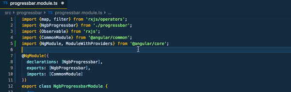

# ES6 and TypeScript import sorter (BETA)

Easily sort import statements in JavaScript and TypeScript files.

## Features

Sort import statements by invoking `VSCode`'s [command pallete](https://code.visualstudio.com/docs/getstarted/userinterface#_command-palette) and searching for `Sort imports` command.

## Known Issues

No know issues.

## Future plans

* Read configuration from `eslint.json` and `tslint.json` file
* Create an `npm` executable library (useful for CI)
* Support different ways to invoke the extension (i.e. sort imports on save)

## Release Notes

See [CHANGELOG.md](https://github.com/znikola/vscode-es6-typescript-import-sorter/blob/master/CHANGELOG.md)

## Contributing

See [CONTRIBUTING.md](https://github.com/znikola/vscode-es6-typescript-import-sorter/blob/master/CONTRIBUTING.md)